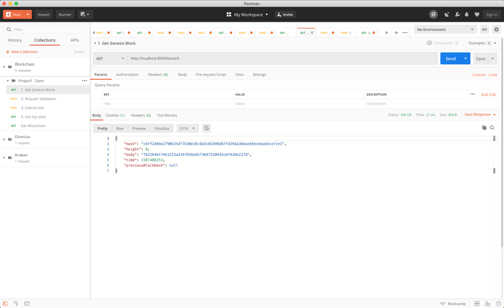
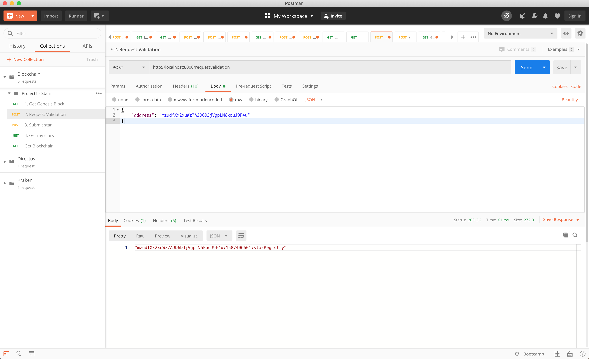
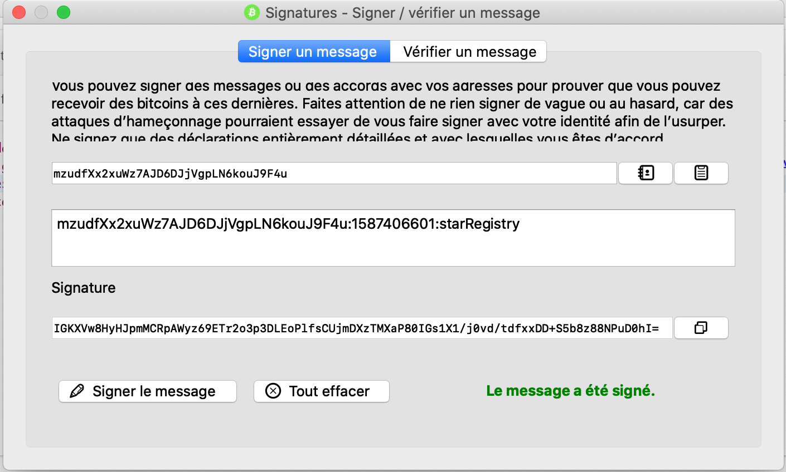
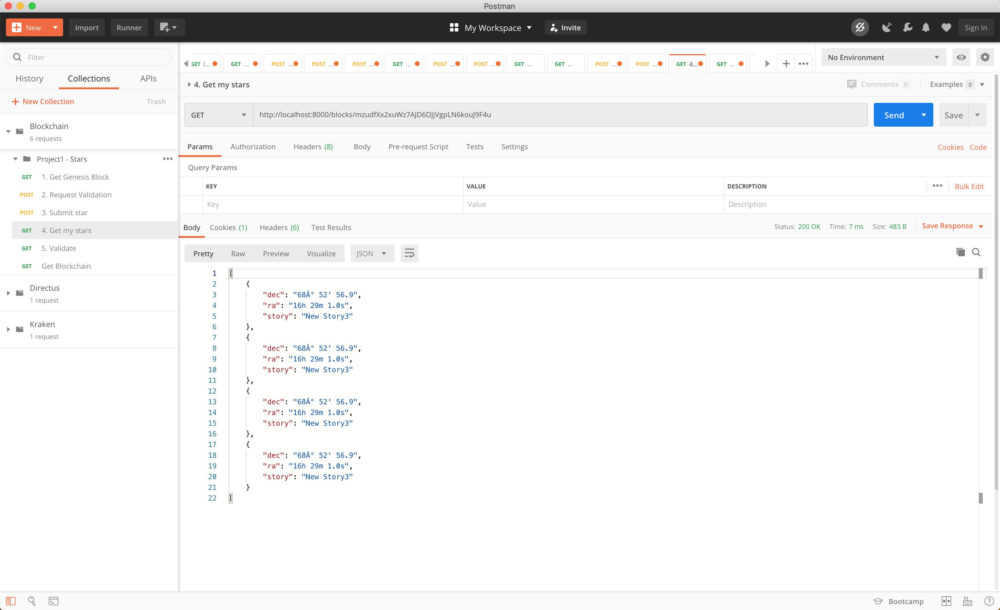

# Private Blockchain Application

## How to run
`
	yarn && yarn start
`

## How to use
- `GET /`: Get the entire blockchain
- `GET /block/:height`: Get the block at :height
- `POST /requestValidation`: Get a validation message
- `POST /submitstar`: Send a star to be saved
- `GET /block/hash/:hash`: Get the block with :hash
- `GET /blocks/:address`: Get the stars with owner :address
- `GET /errors`: Get the blockchain validation errors

## Screenshots
### Get genesis block

### Request validation

### Sign message

### Submit star

#### Get my stars
